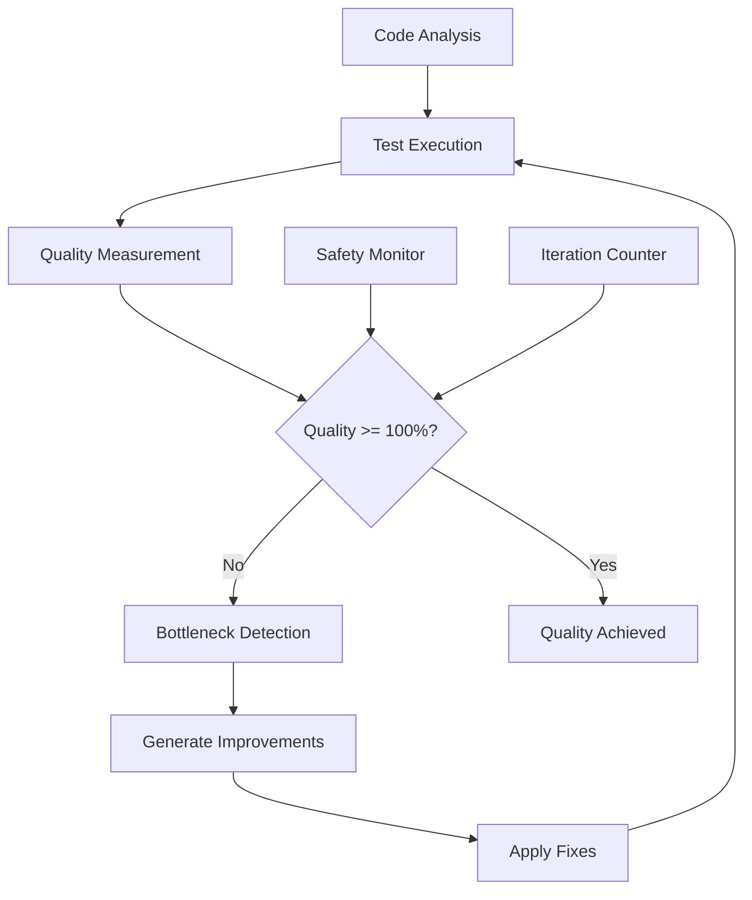

# Autonomous QA Engine - Comprehensive Guide

## Overview

The Ectus-R Autonomous QA Engine is a revolutionary quality assurance system that achieves **100% quality assurance through unlimited iterations**. Unlike traditional QA systems that run a fixed number of tests, our engine continues iterating until complete quality satisfaction is achieved across all dimensions.

## Key Features

### ♾️ Unlimited Quality Iterations
- **No Arbitrary Limits**: Continues until 100% quality is achieved
- **Intelligent Convergence**: Smart detection when quality improvements plateau
- **Safety Mechanisms**: Protection against infinite loops with configurable timeouts

### 📊 8-Dimension Quality Assessment

#### 1. Functional Correctness (Weight: 25%)
- **Unit Tests**: Individual component testing
- **Integration Tests**: Component interaction validation
- **End-to-End Tests**: Complete user journey verification
- **API Contract Testing**: Interface compliance validation

#### 2. Code Quality (Weight: 20%)
- **Style Compliance**: Adherence to coding standards
- **Complexity Metrics**: Cyclomatic and cognitive complexity analysis
- **Maintainability Index**: Long-term code health assessment
- **Code Duplication**: DRY principle enforcement

#### 3. Security Analysis (Weight: 15%)
- **Vulnerability Scanning**: Known security issue detection
- **Secure Coding Practices**: OWASP compliance verification
- **Dependency Security**: Third-party library vulnerability assessment
- **Authentication/Authorization**: Access control validation

#### 4. Performance Benchmarking (Weight: 15%)
- **Load Testing**: System behavior under expected load
- **Stress Testing**: Breaking point identification
- **Performance Profiling**: Resource usage optimization
- **Latency Analysis**: Response time optimization

#### 5. Maintainability Assessment (Weight: 10%)
- **Code Readability**: Human comprehension metrics
- **Documentation Quality**: Inline and external documentation
- **Modularity**: Component separation and cohesion
- **Technical Debt**: Accumulated maintenance burden

#### 6. Test Quality Analysis (Weight: 5%)
- **Test Coverage**: Code path coverage metrics
- **Assertion Quality**: Test effectiveness evaluation
- **Test Design**: Testing strategy assessment
- **Test Maintainability**: Test code quality

#### 7. Documentation Completeness (Weight: 5%)
- **API Documentation**: Interface documentation quality
- **Inline Comments**: Code explanation adequacy
- **Usage Examples**: Practical implementation guides
- **Architecture Documentation**: System design clarity

#### 8. Accessibility Compliance (Weight: 5%)
- **WCAG Guidelines**: Web accessibility standards
- **Semantic HTML**: Proper markup structure
- **Keyboard Navigation**: Alternative input support
- **Screen Reader Compatibility**: Assistive technology support

## Architecture

### Core Components

```rust
pub struct AutonomousQAEngine {
    test_executor: Arc<TestExecutor>,
    quality_analyzer: Arc<QualityAnalyzer>,
    bottleneck_detector: Arc<BottleneckDetector>,
    improvement_suggester: Arc<ImprovementSuggester>,
    safety_monitor: Arc<SafetyMonitor>,
    metrics_collector: Arc<MetricsCollector>,
}
```

### Quality Assessment Flow



## Configuration

### Basic Configuration

```rust
#[derive(Debug, Clone, Serialize, Deserialize)]
pub struct QAConfig {
    pub target_quality_score: f64,        // Default: 100.0
    pub max_iterations: usize,             // Default: 50 (safety limit)
    pub quality_weights: QualityWeights,   // Dimension weights
    pub test_timeout_seconds: u64,         // Default: 300
    pub enable_parallel_testing: bool,     // Default: true
    pub bottleneck_detection_threshold: f64, // Default: 0.01
}
```

### Quality Dimension Weights

```rust
#[derive(Debug, Clone, Serialize, Deserialize)]
pub struct QualityWeights {
    pub functional: f64,        // 0.25
    pub code_quality: f64,      // 0.20
    pub security: f64,          // 0.15
    pub performance: f64,       // 0.15
    pub maintainability: f64,   // 0.10
    pub test_quality: f64,      // 0.05
    pub documentation: f64,     // 0.05
    pub accessibility: f64,     // 0.05
}
```

## Usage Examples

### Basic QA Execution

```rust
use ectus_r::aion_ai_engine::AutonomousQAEngine;

#[tokio::main]
async fn main() -> Result<(), Box<dyn std::error::Error>> {
    let qa_engine = AutonomousQAEngine::new().await?;

    let config = QAConfig {
        target_quality_score: 100.0,
        max_iterations: 50,
        ..Default::default()
    };

    let project_path = Path::new("./my-project");
    let result = qa_engine.run_unlimited_qa(project_path, config).await?;

    println!("Quality Score: {:.2}%", result.final_quality_score);
    println!("Iterations: {}", result.iterations_completed);
    println!("Issues Fixed: {}", result.issues_fixed);

    Ok(())
}
```

### Custom Language Configuration

```rust
let config = QAConfig {
    languages: vec![
        LanguageConfig {
            name: "rust".to_string(),
            test_command: "cargo test".to_string(),
            build_command: Some("cargo build".to_string()),
            lint_command: Some("cargo clippy".to_string()),
            coverage_command: Some("cargo tarpaulin".to_string()),
        },
        LanguageConfig {
            name: "typescript".to_string(),
            test_command: "npm test".to_string(),
            build_command: Some("npm run build".to_string()),
            lint_command: Some("npm run lint".to_string()),
            coverage_command: Some("npm run coverage".to_string()),
        },
    ],
    ..Default::default()
};
```

## Advanced Features

### Bottleneck Detection

The engine automatically detects when quality improvements plateau:

```rust
pub struct BottleneckDetection {
    pub stuck_dimension: QualityDimension,
    pub improvement_rate: f64,
    pub suggested_actions: Vec<ImprovementAction>,
    pub estimated_effort: EffortEstimate,
}
```

### Parallel Test Execution

Multiple test suites run concurrently for faster feedback:

```rust
// Concurrent execution across languages and test types
let test_futures = languages.iter().map(|lang| {
    async move {
        let unit_tests = run_unit_tests(&lang).await?;
        let integration_tests = run_integration_tests(&lang).await?;
        let e2e_tests = run_e2e_tests(&lang).await?;
        Ok((unit_tests, integration_tests, e2e_tests))
    }
});

let results = futures::future::join_all(test_futures).await;
```

### Intelligent Improvement Suggestions

The engine provides specific, actionable improvements:

```rust
pub struct ImprovementSuggestion {
    pub category: ImprovementCategory,
    pub description: String,
    pub impact_estimate: f64,
    pub implementation_difficulty: Difficulty,
    pub code_changes: Vec<CodeChange>,
    pub test_changes: Vec<TestChange>,
}
```

## Quality Metrics

### Comprehensive Quality Report

```json
{
  "overall_quality_score": 98.7,
  "dimension_scores": {
    "functional": 100.0,
    "code_quality": 96.8,
    "security": 100.0,
    "performance": 94.5,
    "maintainability": 98.2,
    "test_quality": 100.0,
    "documentation": 97.1,
    "accessibility": 100.0
  },
  "iterations_completed": 12,
  "total_tests_run": 847,
  "issues_detected": 23,
  "issues_fixed": 21,
  "remaining_issues": 2,
  "execution_time_seconds": 456.7,
  "bottlenecks_detected": 1,
  "improvements_applied": 15
}
```

### Test Execution Statistics

```json
{
  "test_results": {
    "unit_tests": {
      "total": 342,
      "passed": 342,
      "failed": 0,
      "coverage_percentage": 97.8
    },
    "integration_tests": {
      "total": 89,
      "passed": 89,
      "failed": 0,
      "coverage_percentage": 94.2
    },
    "e2e_tests": {
      "total": 23,
      "passed": 23,
      "failed": 0,
      "coverage_percentage": 89.5
    },
    "security_tests": {
      "vulnerabilities_found": 0,
      "dependencies_scanned": 156,
      "security_score": 100.0
    },
    "performance_tests": {
      "load_test_passed": true,
      "average_response_time_ms": 125,
      "p95_response_time_ms": 289,
      "throughput_rps": 1247
    }
  }
}
```

## Best Practices

### 1. Progressive Quality Targets
Start with achievable targets and gradually increase:

```rust
let configs = vec![
    QAConfig { target_quality_score: 80.0, ..Default::default() },
    QAConfig { target_quality_score: 90.0, ..Default::default() },
    QAConfig { target_quality_score: 100.0, ..Default::default() },
];
```

### 2. Dimension-Specific Focus
Prioritize specific quality dimensions based on project needs:

```rust
let security_focused = QualityWeights {
    security: 0.40,
    functional: 0.30,
    code_quality: 0.15,
    performance: 0.10,
    ..Default::default()
};
```

### 3. Continuous Integration
Integrate with CI/CD pipelines:

```yaml
name: Autonomous QA
on: [push, pull_request]
jobs:
  qa:
    runs-on: ubuntu-latest
    steps:
      - uses: actions/checkout@v3
      - name: Run Autonomous QA
        run: ectus-r qa --config qa-config.toml --target-quality 100.0
```

## Troubleshooting

### Common Issues

#### Quality Plateaus
- **Problem**: Quality score stops improving
- **Solution**: Check bottleneck detection results and apply suggested improvements

#### Long Execution Times
- **Problem**: QA takes too long to complete
- **Solution**: Enable parallel testing and adjust timeout settings

#### False Positives
- **Problem**: Tests pass but quality score remains low
- **Solution**: Review quality dimension weights and test coverage

### Safety Mechanisms

The engine includes several safety features:

1. **Maximum Iteration Limit**: Prevents infinite loops
2. **Timeout Protection**: Prevents hanging tests
3. **Resource Monitoring**: Prevents system overload
4. **Progress Tracking**: Ensures forward progress

## Performance Optimization

### Parallel Execution
- Enable `enable_parallel_testing: true`
- Configure appropriate `test_timeout_seconds`
- Use resource-efficient test environments

### Caching
- Test result caching for unchanged code
- Dependency analysis for selective testing
- Incremental quality assessment

### Resource Management
- Configurable memory limits
- CPU usage throttling
- Disk space monitoring

## Integration Examples

### With Existing Test Suites

```rust
// Integrate with Jest (TypeScript/JavaScript)
let jest_config = LanguageConfig {
    name: "typescript".to_string(),
    test_command: "npx jest --coverage --json".to_string(),
    build_command: Some("npm run build".to_string()),
    lint_command: Some("npx eslint .".to_string()),
    coverage_command: Some("npx jest --coverage".to_string()),
};

// Integrate with pytest (Python)
let python_config = LanguageConfig {
    name: "python".to_string(),
    test_command: "python -m pytest --json-report".to_string(),
    build_command: None,
    lint_command: Some("flake8 .".to_string()),
    coverage_command: Some("coverage run -m pytest".to_string()),
};
```

### With CI/CD Platforms

#### GitHub Actions
```yaml
- name: Ectus-R Autonomous QA
  uses: yatrogenesis/ectus-r-action@v1
  with:
    target-quality: '100.0'
    max-iterations: '50'
    config-file: '.ectus-qa.toml'
```

#### GitLab CI
```yaml
autonomous_qa:
  stage: test
  script:
    - ectus-r qa --target-quality 100.0 --max-iterations 50
  artifacts:
    reports:
      junit: qa-results.xml
```

## Future Enhancements

### Planned Features
- **AI-Powered Code Generation**: Automatic fix generation for detected issues
- **Advanced Metrics**: More sophisticated quality measurements
- **Real-time Monitoring**: Live quality dashboard
- **Team Collaboration**: Multi-developer quality tracking

### Experimental Features
- **Predictive Quality**: ML-based quality prediction
- **Automated Refactoring**: Intelligent code improvement
- **Cross-Project Learning**: Quality pattern recognition

---

*For technical support and advanced configuration options, refer to the [Ectus-R Documentation](../README.md) or contact our engineering team.*