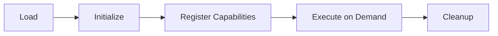

# Ectus-R Plugin SDK

Official SDK for extending Ectus-R with custom code generators, analyzers, and transformations.

## Overview

The Ectus-R Plugin SDK enables developers to create:
- **Language Generators**: Add support for new programming languages
- **Framework Templates**: Create custom framework scaffolding
- **Code Analyzers**: Build custom static analysis tools
- **Transformations**: Implement code refactoring and optimization plugins
- **Custom AI Models**: Integrate specialized AI models for domain-specific generation

## Quick Start

### TypeScript/JavaScript Plugin

```bash
npm install @ectus-r/plugin-sdk
```

```typescript
import { Plugin, CodeGenerator, PluginContext } from '@ectus-r/plugin-sdk';

export class MyLanguageGenerator implements CodeGenerator {
  name = 'my-language-generator';
  version = '1.0.0';
  supportedLanguages = ['mylang'];

  async generate(context: PluginContext): Promise<GeneratedFiles> {
    const files = [];

    // Access requirements analysis
    const requirements = context.getRequirements();

    // Generate code
    files.push({
      path: 'src/main.mylang',
      content: this.generateMainFile(requirements),
      language: 'mylang'
    });

    return { files };
  }

  private generateMainFile(requirements: Requirements): string {
    return `
      // Generated by MyLang Generator
      module Main {
        function start() {
          println("Hello from ${requirements.projectName}");
        }
      }
    `;
  }
}

// Register plugin
export default new Plugin({
  name: 'my-language-plugin',
  version: '1.0.0',
  generators: [new MyLanguageGenerator()],
});
```

### Rust Plugin

```rust
use ectus_plugin_sdk::{Plugin, CodeGenerator, PluginContext, GeneratedFile};

pub struct MyLanguageGenerator;

impl CodeGenerator for MyLanguageGenerator {
    fn name(&self) -> &str {
        "my-language-generator"
    }

    fn supported_languages(&self) -> Vec<String> {
        vec!["mylang".to_string()]
    }

    async fn generate(&self, context: &PluginContext) -> Result<Vec<GeneratedFile>> {
        let requirements = context.get_requirements();

        let main_file = GeneratedFile {
            path: PathBuf::from("src/main.mylang"),
            content: self.generate_main_file(&requirements),
            language: "mylang".to_string(),
        };

        Ok(vec![main_file])
    }
}

impl MyLanguageGenerator {
    fn generate_main_file(&self, requirements: &Requirements) -> String {
        format!(r#"
// Generated by MyLang Generator
module Main {{
    function start() {{
        println("Hello from {}");
    }}
}}
"#, requirements.project_name)
    }
}

// Export plugin
#[no_mangle]
pub extern "C" fn create_plugin() -> Box<dyn Plugin> {
    Box::new(MyLanguageGenerator)
}
```

## Plugin Architecture

### Plugin Types

1. **Code Generators**
   - Generate source code from requirements
   - Support multiple languages and frameworks
   - Access to AI-powered analysis

2. **Analyzers**
   - Static code analysis
   - Security scanning
   - Performance profiling

3. **Transformers**
   - Code refactoring
   - Migration tools
   - Optimization engines

4. **Templates**
   - Project scaffolding
   - Component templates
   - Best practice patterns

### Plugin Lifecycle



## API Reference

### PluginContext

```typescript
interface PluginContext {
  // Requirements analysis
  getRequirements(): Requirements;
  getArchitecture(): SystemArchitecture;

  // Project context
  getProjectPath(): string;
  getConfiguration(): PluginConfig;

  // AI Services
  invokeAI(prompt: string, model?: string): Promise<string>;
  analyzeCode(code: string): Promise<CodeAnalysis>;

  // Logging
  log(level: 'info' | 'warn' | 'error', message: string): void;
}
```

### Requirements Interface

```typescript
interface Requirements {
  projectName: string;
  description: string;
  functionalRequirements: string[];
  nonFunctionalRequirements: string[];
  targetLanguage: string;
  framework?: string;
  constraints: Constraints;
}
```

### GeneratedFile

```typescript
interface GeneratedFile {
  path: string;
  content: string;
  language: string;
  purpose?: string;
  dependencies?: string[];
}
```

## Examples

### Framework Template Plugin

```typescript
import { Plugin, TemplateGenerator } from '@ectus-r/plugin-sdk';

class ReactAppTemplate implements TemplateGenerator {
  name = 'react-app-template';

  async generate(context: PluginContext): Promise<GeneratedFiles> {
    const projectName = context.getRequirements().projectName;

    return {
      files: [
        {
          path: 'package.json',
          content: this.generatePackageJson(projectName),
          language: 'json'
        },
        {
          path: 'src/App.tsx',
          content: this.generateApp(projectName),
          language: 'typescript'
        },
        {
          path: 'src/index.tsx',
          content: this.generateIndex(),
          language: 'typescript'
        }
      ]
    };
  }

  private generatePackageJson(name: string): string {
    return JSON.stringify({
      name,
      version: '0.1.0',
      dependencies: {
        'react': '^18.2.0',
        'react-dom': '^18.2.0'
      },
      scripts: {
        start: 'react-scripts start',
        build: 'react-scripts build',
        test: 'react-scripts test'
      }
    }, null, 2);
  }

  private generateApp(projectName: string): string {
    return `
import React from 'react';

function App() {
  return (
    <div className="App">
      <h1>${projectName}</h1>
      <p>Generated by Ectus-R</p>
    </div>
  );
}

export default App;
    `;
  }

  private generateIndex(): string {
    return `
import React from 'react';
import ReactDOM from 'react-dom/client';
import App from './App';

const root = ReactDOM.createRoot(
  document.getElementById('root') as HTMLElement
);

root.render(
  <React.StrictMode>
    <App />
  </React.StrictMode>
);
    `;
  }
}

export default new Plugin({
  name: 'react-template-plugin',
  version: '1.0.0',
  templates: [new ReactAppTemplate()]
});
```

### Security Analyzer Plugin

```rust
use ectus_plugin_sdk::{Analyzer, AnalysisResult, SecurityIssue};

pub struct CustomSecurityAnalyzer;

impl Analyzer for CustomSecurityAnalyzer {
    fn name(&self) -> &str {
        "custom-security-analyzer"
    }

    async fn analyze(&self, context: &PluginContext) -> Result<AnalysisResult> {
        let files = context.get_generated_files();
        let mut issues = Vec::new();

        for file in files {
            // Check for hardcoded secrets
            if self.contains_hardcoded_secrets(&file.content) {
                issues.push(SecurityIssue {
                    severity: "HIGH",
                    category: "Hardcoded Secrets",
                    file: file.path.clone(),
                    line: 0,
                    description: "Potential hardcoded secret detected".to_string(),
                });
            }

            // Check for SQL injection vulnerabilities
            if file.language == "sql" || file.language == "typescript" {
                let sql_issues = self.check_sql_injection(&file.content);
                issues.extend(sql_issues);
            }
        }

        Ok(AnalysisResult {
            issues,
            score: self.calculate_security_score(&issues),
        })
    }
}
```

## Plugin Distribution

### NPM Package

```json
{
  "name": "@myorg/ectus-plugin-mylang",
  "version": "1.0.0",
  "main": "dist/index.js",
  "types": "dist/index.d.ts",
  "ectusPlugin": {
    "type": "generator",
    "languages": ["mylang"],
    "entry": "dist/index.js"
  },
  "peerDependencies": {
    "@ectus-r/plugin-sdk": "^1.0.0"
  }
}
```

### Cargo Crate

```toml
[package]
name = "ectus-plugin-mylang"
version = "1.0.0"
edition = "2021"

[lib]
crate-type = ["cdylib"]

[dependencies]
ectus-plugin-sdk = "1.0"

[package.metadata.ectus]
type = "generator"
languages = ["mylang"]
```

## Testing Plugins

```typescript
import { PluginTester } from '@ectus-r/plugin-sdk/testing';

describe('MyLanguageGenerator', () => {
  const tester = new PluginTester();

  it('generates valid code', async () => {
    const result = await tester.testGenerator(
      new MyLanguageGenerator(),
      {
        requirements: {
          projectName: 'test-project',
          description: 'A test project',
          functionalRequirements: ['User authentication'],
          targetLanguage: 'mylang'
        }
      }
    );

    expect(result.files).toHaveLength(1);
    expect(result.files[0].path).toBe('src/main.mylang');
    expect(result.files[0].content).toContain('module Main');
  });
});
```

## Publishing Plugins

### To Ectus Marketplace

```bash
ectus plugin publish
```

### To NPM

```bash
npm publish
```

### To Crates.io

```bash
cargo publish
```

## Best Practices

1. **Error Handling**: Always handle errors gracefully and provide meaningful messages
2. **Performance**: Optimize for large codebases; use streaming where possible
3. **Security**: Never execute untrusted code; validate all inputs
4. **Versioning**: Use semantic versioning for compatibility
5. **Documentation**: Provide clear examples and API documentation
6. **Testing**: Write comprehensive tests for all plugin functionality

## Support

- Documentation: https://docs.ectus-r.dev/plugins
- Examples: https://github.com/Yatrogenesis/ectus-r-plugins
- Community: https://discord.gg/ectus-r
- Issues: https://github.com/Yatrogenesis/Ectus-R/issues

## License

MIT License - See LICENSE file for details
